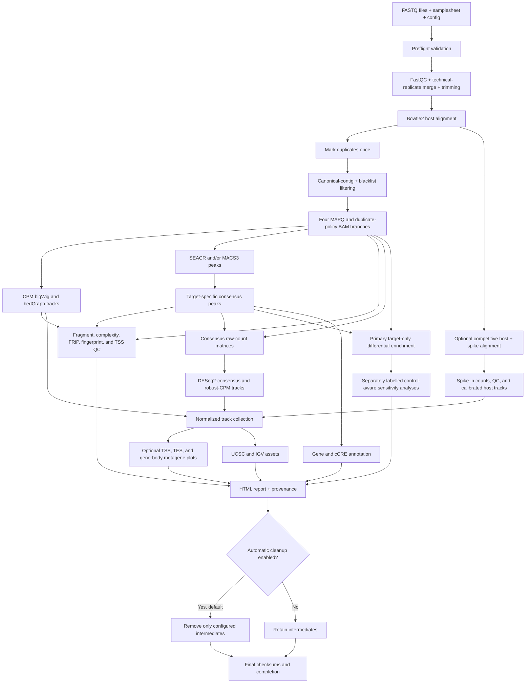

# cutnrun2tracks 0.2.4

`cutnrun2tracks` is a samplesheet-driven Bash workflow for paired-end and
single-end CUT&RUN and CUT&Tag data. It provides assay-aware alignment,
filtering, coverage, peak calling, QC, aggregate-signal plotting, differential
enrichment, annotation, browser assets, and reporting in a Conda-managed Linux
environment.

It is an independent scientific refactor of the
[ATACseq2tracks](https://github.com/MichalGd/ATACseq2tracks) v4.2.0 engineering
base; it does not modify or call an ATACseq2tracks installation.

> **Status:** development release. Synthetic interface and scientific tests are
> included. Validate the workflow with small representative CUT&RUN and CUT&Tag
> datasets in the locked Linux environment before production interpretation.

## Principal capabilities

- explicit run-wide `cutrun` and `cuttag` assay profiles;
- paired-end and single-end inputs, with technical-replicate merging;
- strict, non-executable configuration parsing and CSV validation;
- exact replicate-matched IgG, input, or mock control mapping;
- Bowtie2 host alignment or optional competitive host-plus-spike alignment;
- duplicate marking once and four inspectable MAPQ/duplicate BAM branches;
- pair-safe canonical-contig and blacklist filtering;
- CPM, DESeq2-consensus, and three DESeq2 robust-CPM track families;
- MACS3 `BAMPE` and CUT-specific single-end presets, plus PE-only SEACR;
- target-, antibody-, caller-, and peak-class-specific consensus peaks;
- fragment-aware PE counting, FRiP, fragment length, fingerprints, complexity,
  and descriptive TSS QC;
- reusable TSS-, TES-, and scaled-gene-body profiles and heatmaps from
  upstream-normalized bigWigs;
- DESeq2Enrichment and DiffBind target-only analyses, plus separately labelled
  control-subtracted and target-control interaction sensitivity analyses;
- gene/cCRE overlap annotation, UCSC/IGV assets, provenance, checksummed JSON
  checkpoints, HTML reporting, and guarded cleanup.

Different factors and antibody IDs form separate cohorts. The workflow refuses
to estimate normalization factors across different targets.

## Workflow overview



Stages use signature-and-output checkpoints and can resume independently.
Normalized browser tracks are never used as count input for differential
testing. See [Pipeline stages](docs/07_pipeline_stages.md) for the exact stage
order, controls, and principal outputs.

## Important scientific definitions

### Controls

Controls have deliberately separate roles:

1. matched background for SEACR/MACS3 peak calling;
2. target-control QC and fingerprint plots;
3. optional, explicitly labelled sensitivity analyses.

The primary differential analysis counts raw target fragments or reads over a
condition-unbiased cohort consensus. IgG/input/mock controls are not biological
replicates, are not subtracted from primary DESeq2 input, and do not determine
standard DESeq2 size factors. Spike-in calibration is an independent operation.
See [Controls and differential enrichment](docs/03_differential_enrichment.md).

### Track normalization

Five host coverage families can be generated independently:

- `04_tracks/cpm/*.{CPM.bw,CPM.bedGraph}`: analysis-fragment/read CPM;
- `04_tracks/deseq2_consensus/`: raw coverage scaled by the inverse cohort
  DESeq2 `poscounts` size factor;
- `04_tracks/deseq2_robust_cpm/permissive/`: MAPQ 0, duplicates retained;
- `04_tracks/deseq2_robust_cpm/intermediate/`: MAPQ 0, duplicates removed;
- `04_tracks/deseq2_robust_cpm/stringent/`: MAPQ 30, duplicates removed.

An enabled spike-in branch adds calibrated host tracks and separate spike
control tracks. It is not layered on DESeq2 scaling. Track families are for
visualization and aggregate-signal plots; differential models use raw counts.
The formulas and signal units are documented in
[Methods and normalization](docs/02_methods.md).

### Cohorts and consensus peaks

A cohort key includes genome, assay profile, factor, antibody ID, layout,
target class, duplicate policy, primary caller, and primary peak class.
Consensus support is measured across biological sample keys after technical
replicates have been merged. The default minimum is two biological samples;
this pragmatic support rule is not formal IDR.

## Repository layout

```text
cutnrun2tracks/
├── cutnrun2tracks.sh             main workflow entry point
├── VERSION                       authoritative runtime version
├── environment.yml               Conda environment specification
├── environment.lock.yml          locked environment record
├── config/
│   ├── config.conf.template      complete configuration template
│   ├── samplesheet_template.csv  authoritative samplesheet header
│   └── examples/                 CUT&RUN, CUT&Tag, SE, and spike examples
├── common/metagene/              reusable aggregate-signal module
├── scripts/                      workflow stages and analysis helpers
├── utilities/                    offline reference preparation utilities
├── tests/                        static and synthetic regression tests
├── provenance/                   source and reference provenance records
└── docs/                         user and scientific documentation
```

## Quick start

Linux and Bash 5.1 or newer are required.

```bash
git clone https://github.com/MichalGd/cutnrun2tracks.git
cd cutnrun2tracks

mamba env create -f environment.yml
conda activate cutnrun2tracks-0.2.4

mkdir -p /path/to/project/config
cp config/config.conf.template /path/to/project/config/config.conf
cp config/examples/cutrun_pe.csv /path/to/project/config/samplesheet.csv
```

Edit the copied files, then validate the metadata plan and the complete runtime
environment before processing reads:

```bash
bash cutnrun2tracks.sh \
    --config /path/to/project/config/config.conf \
    --plan

bash cutnrun2tracks.sh \
    --config /path/to/project/config/config.conf \
    --preflight-only

bash cutnrun2tracks.sh \
    --config /path/to/project/config/config.conf
```

Use `config/examples/cutrun_se.csv`, `cuttag_pe.csv`, or `spikein.csv` as the
starting point when appropriate. Example paths are illustrative and must be
replaced. See [Inputs and configuration](docs/01_inputs_and_configuration.md)
before preparing a production samplesheet.

## Installation

Create the environment with Mamba or Conda:

```bash
mamba env create -f environment.yml
conda activate cutnrun2tracks-0.2.4
```

SEACR 1.3 is not installed by the Conda environment. Install it separately from
the [upstream SEACR repository](https://github.com/FredHutch/SEACR), set its
immutable path in `SEACR_COMMAND`, and record the downloaded commit and checksum
in the local environment record. Single-end runs must use MACS3 because this
workflow rejects SEACR for SE libraries.

For deployment beside an existing ATACseq2tracks installation, including the
recommended cloned-environment strategy, all-user read/execute access, a
system-wide launcher, and exact shared-reference mappings,
follow the [server installation runbook](docs/08_server_installation.md).

After copying the repository from Windows, restore executable bits if needed:

```bash
chmod +x cutnrun2tracks.sh scripts/*.sh scripts/*.py \
    common/metagene/*.sh common/metagene/*.py tests/*.sh utilities/*.sh
```

## Configuration and inputs

Copy `config/config.conf.template` outside the installed code directory and
edit the copy. At minimum, set:

- `SAMPLESHEET`, `OUTPUT_DIR`, and one run-wide `ASSAY_PROFILE`;
- the Bowtie2 index, FASTA, chromosome sizes, canonical contigs, GTF, and
  blacklist for the selected genome;
- the peak caller and matched-control policy;
- spike-in references and metadata only when `SPIKEIN_MODE` is enabled.

Useful defaults to review explicitly are:

```bash
ASSAY_PROFILE=cutrun
MIN_MAPQ=30
TARGET_DEFAULT_DUPLICATE_POLICY=retain
CONTROL_DEFAULT_DUPLICATE_POLICY=remove
PEAK_CALLERS=seacr,macs3
REQUIRE_MATCHED_CONTROL=true
CONSENSUS_MIN_BIOLOGICAL_SAMPLES=2
RUN_DESEQ2_ENRICHMENT=true
RUN_DIFFBIND=true
DIFFERENTIAL_CONTROL_MODE=peak_calling_only
RUN_CONTROL_SUBTRACTED_SENSITIVITY=true
RUN_TARGET_CONTROL_INTERACTION=false
RUN_METAGENE=false
SPIKEIN_MODE=none
ENABLE_AUTOMATIC_CLEANUP=true
```

Preprocessing has two independent resource controls. The sample-worker limit
caps concurrent libraries, while the per-tool settings control CPU use inside
each worker:

```bash
QC_SAMPLE_PARALLEL_JOBS=8
THREADS_FASTQC=10
THREADS_TRIMGALORE=8
```

These high-capacity-server defaults can request up to roughly 80 CPU threads
during FastQC and 64 during trimming. Reduce the values when sharing a smaller
server; do not estimate total use from `QC_SAMPLE_PARALLEL_JOBS` alone.

One samplesheet row is a sequencing unit. Rows with the same `sample_id`,
`replicate`, and distinct `tech_replicate` values are merged before trimming;
biological replicates remain independent. A target names its control through
`control_id`, and the validator requires an exact replicate and biological
context match unless shared controls are explicitly enabled.

## Running, checkpoints, and recovery

```bash
bash cutnrun2tracks.sh --config /absolute/path/to/config.conf
```

Every completed stage writes a JSON checkpoint under
`<OUTPUT_DIR>/.checkpoints/`. Checkpoints contain the complete run signature and
hashes of declared outputs. A changed configuration, samplesheet, workflow
version, script, shared module, reference manifest, or declared output
invalidates the affected resume state.

Reuse validated outputs before a stage, then force that stage and every later
stage:

```bash
bash cutnrun2tracks.sh \
    --config /absolute/path/to/config.conf \
    --from-stage qc
```

With `--from-stage`, every earlier checkpoint is revalidated against its stored
file sizes and SHA-256 hashes before its signature is explicitly adopted into
the current run. A missing or changed earlier output stops recovery. The named
stage and all later stages always rerun. This explicit recovery mode is suitable
after a code-only repair that does not alter earlier-stage outputs; choose an
earlier starting stage if the change could affect them.

Stop cleanly after a named stage:

```bash
bash cutnrun2tracks.sh \
    --config /absolute/path/to/config.conf \
    --stop-after consensus
```

Automatic cleanup runs only after report generation. Set
`ENABLE_AUTOMATIC_CLEANUP=false` before the run when intermediates are needed
for troubleshooting or planned partial reruns. See
[Outputs and recovery](docs/04_outputs_and_recovery.md).

## Pipeline stages

| Order | Stage name | Operation |
|---:|---|---|
| 1 | `preflight` | Validate tools, configuration, samplesheet, references, and policies |
| 2 | `preprocess` | Merge technical FASTQs, FastQC, Trim Galore, and MultiQC |
| 3 | `alignment` | Bowtie2 host alignment and optional competitive spike alignment |
| 4 | `filtering` | Mark duplicates; produce four MAPQ/duplicate-policy BAM branches |
| 5 | `cpm` | Per-sample fragment/read CPM bigWig and bedGraph tracks |
| 6 | `peakcalling` | Matched-control SEACR and/or MACS3 calls with per-sample fault isolation |
| 7 | `consensus` | Target-specific consensus from successful primary peak sets, with exclusions reported |
| 8 | `spikein` | Spike-in counts, QC, calibrated host tracks, and control tracks |
| 9 | `normalized_tracks` | DESeq2-consensus and robust-CPM track families |
| 10 | `metagene` | Optional TSS, TES, and scaled-gene-body plots and heatmaps |
| 11 | `qc` | Complexity, fragments, FRiP, fingerprints, TSS, and optional experimental ataqv |
| 12 | `differential` | Primary raw-count enrichment and optional control-aware sensitivity models |
| 13 | `annotation` | Gene/cCRE overlaps plus UCSC and IGV assets |
| 14 | `report` | HTML report and reporting tables |
| 15 | `cleanup` | Guarded removal of configured intermediates after report success |
| 16 | `finalize` | Final file checksums and completion checkpoint |

## Principal outputs

```text
<OUTPUT_DIR>/
├── 00_metadata/                    resolved config, sample/cohort/reference manifests
├── 01_fastq_qc/                    raw/trimmed FastQC and MultiQC
├── 02_trimmed_fastq/               merged/trimmed FASTQs; removed by default after success
├── 03_alignment/
│   ├── sorted/                     host BAM intermediates; removed by default
│   ├── marked/                     duplicate-marked BAMs
│   ├── filtered/                   four filtering-policy branches
│   ├── analysis/                   samplesheet-selected quantitative BAMs
│   └── spikein/                    optional intermediates; selected BAMs removed by default
├── 04_tracks/
│   ├── cpm/                        *.CPM.{bw,bedGraph}
│   ├── deseq2_consensus/           DESeq2-consensus tracks and count tables
│   ├── deseq2_robust_cpm/          permissive/intermediate/stringent tracks
│   ├── spikein/                    calibrated host tracks
│   └── spikein_control/            spike-reference control tracks
├── 05_peaks/
│   ├── per_sample/                 SEACR and/or MACS3 peaks
│   └── consensus/                  cohort/caller/peak-class consensus sets
├── 06_qc/                          QC tables, plots, metagene results, spike-in QC
├── 07_annotation/                  consensus and differential annotations
├── 08_differential/                primary and sensitivity analyses
├── 09_browser/                     UCSC track definitions and IGV session
├── 10_reports/                     pipeline HTML report and report assets
├── logs/                           stage and tool logs
└── .checkpoints/                   signature-and-output JSON checkpoints
```

Metagene results follow the predictable path
`06_qc/metagene/<genome>/<gene_set>/<mode>/<sample>/`, with matching PNG/PDF
profiles and heatmaps plus a run-wide artifact inventory. Differential results
are separated into `primary_target_only`, `sensitivity_control_subtracted`, and
`sensitivity_target_control_interaction` so sensitivity results cannot be
mistaken for the primary analysis.

## Validation before biological use

Run the repository checks in the locked Linux environment:

```bash
bash tests/check_bash_syntax.sh
bash tests/run_tests.sh
```

Then run small representative PE and SE datasets and confirm that:

- filtered BAMs pass `samtools quickcheck` and have the intended MAPQ/duplicate
  policy;
- target-to-control mappings are exact and appear in the metadata manifests;
- CPM and every enabled normalized track family is non-empty and has recorded
  scaling metadata;
- PE and SE peak-caller commands use the intended profile-specific settings;
- consensus support is counted over biological, not technical, replicates;
- primary differential models use raw target counts and remain separate from
  control-aware sensitivity outputs;
- enabled spike-in controls exceed the configured count thresholds and the
  applied scale matches the recorded formula;
- checkpoint invalidation, partial reruns, reporting, and cleanup behave as
  expected for the local filesystem and scheduler environment.

The complete pilot checklist is in
[Limitations and pilot decisions](docs/05_limitations.md).

## Documentation

| If you need to... | Read... |
|---|---|
| Prepare a samplesheet, controls, and configuration | [Inputs and configuration](docs/01_inputs_and_configuration.md) |
| Understand filtering, signal units, peaks, and track formulas | [Methods and normalization](docs/02_methods.md) |
| Design or interpret differential enrichment | [Controls and differential enrichment](docs/03_differential_enrichment.md) |
| Find outputs, resume a run, or retain intermediates | [Outputs and recovery](docs/04_outputs_and_recovery.md) |
| Review current limitations and pilot-validation decisions | [Limitations and pilot decisions](docs/05_limitations.md) |
| Build gene sets or run aggregate-signal plots | [Metagene module](docs/06_metagene.md) |
| Understand each workflow stage | [Pipeline stages](docs/07_pipeline_stages.md) |
| Install beside an existing ATACseq2tracks deployment | [Server installation and reference reuse](docs/08_server_installation.md) |
| Review test coverage and outstanding integration fixtures | [Test matrix](docs/06_test_matrix.md) |

The complete page list is in the [documentation index](docs/README.md).

## Known limitations

- The workflow is a development release and still requires representative
  real-data validation on the target Linux server.
- SEACR is unsupported for single-end data; CUT-specific MACS3 SE presets are
  provisional and must be validated for the protocol.
- Consensus support of at least two biological samples is not formal IDR.
- Different genomes or PE/SE layouts should be run separately unless the
  corresponding expert overrides have been deliberately validated.
- ataqv is disabled by default and, if enabled, is stored as an experimental
  ATAC-derived output without CUT&RUN/CUT&Tag pass/fail interpretation.
- DiffBind is skipped when arbitrary blocking columns are requested; the
  block-aware DESeq2Enrichment path remains primary.
- The optional target-control interaction model currently supports exactly two
  conditions with one-to-one condition-matched controls and requires pilot
  validation.
- Spike-in calibration is valid only for a consistent, experimentally justified
  spike design. It does not correct arbitrary batch effects or biological
  confounding.
- Metagene plots inherit upstream bigWig normalization and do not make assays or
  normalization families directly comparable by themselves.

See [CHANGELOG.md](CHANGELOG.md) for release history and
[CONTRIBUTING.md](CONTRIBUTING.md) for scientific invariants and test
expectations.
